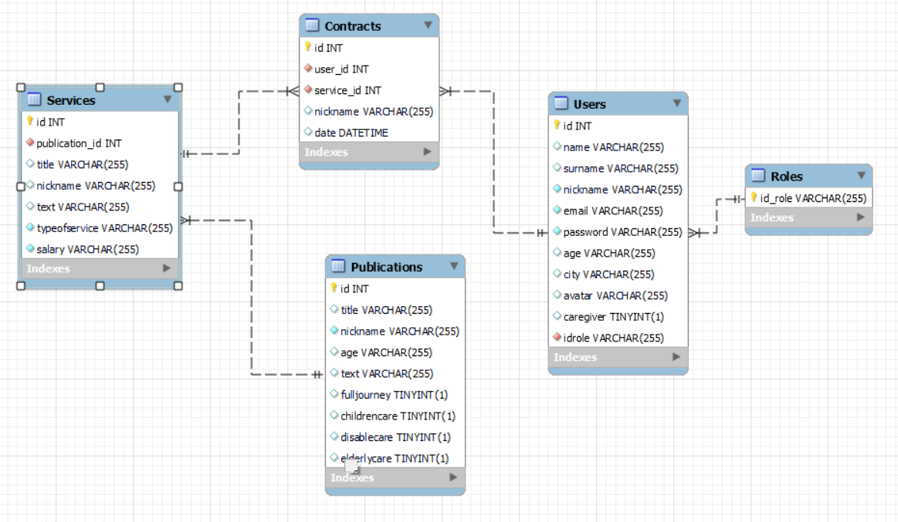

# FSD-TakeCare-Backend

## Abstract 
This project is a part of a full App designed as the last final project of the Bootcamp FSD on GeeksHubs Academy. As the title suggest this repo is a API connected to a DataBase. 

In this case the idea is to create the space through this APP for Caregivers of elderlys, childern, disabled people,etc. The main intention is to provide a centralized spot where this kind of services (customers/workers) can have a place for make offers as customers or as caregivers giving light,help and presence inside the market for this services. 

---

## DDBB Design

The DDBB architecture is focused in the following relationships; 

* One to Many --> User belongs to Role
* One to Many --> Publications belongs to User
* Many to Many --> Between User and Services through Contracts

## Relationship Diagram 

